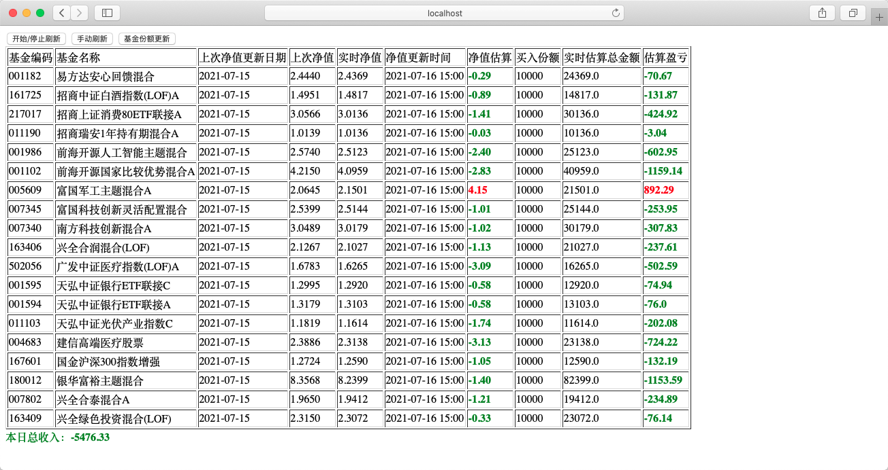
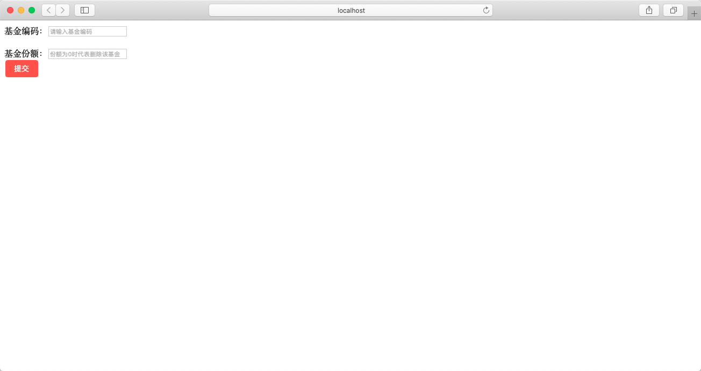
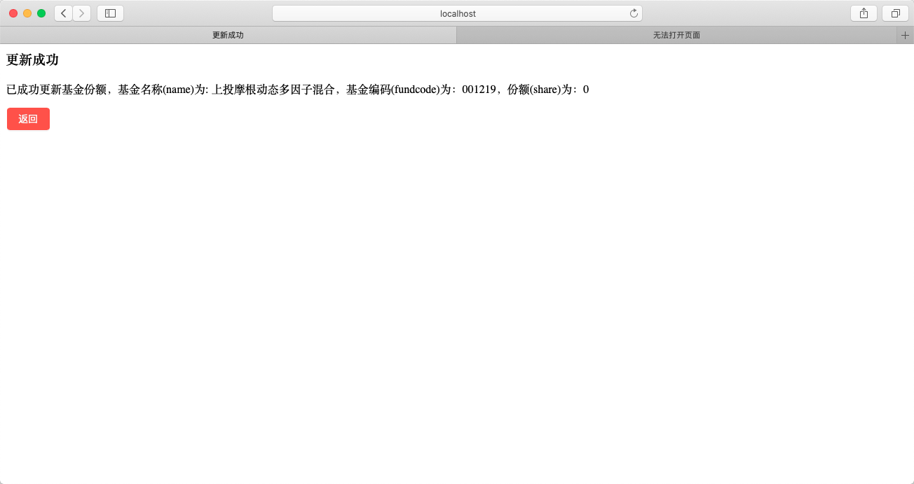

[概述](#概述)
[功能描述](#功能描述)

# 概述
买入基金后，如果以短线赚钱为目的，那么如何快速实时跟踪基金情况是绕不开的一个需求。

该程序可帮助使用者快速的维护、跟踪自己买入的基金，并实时计算出当天收入情况。

由于需求较为简单，该程序采用python编写，体量小、方便快捷。采用BS架构，程序以服务方式运行，用户可通过浏览器快速访问。

# 功能描述

## 基金当日营收情况

### 各基金信息详情

**基金信息**：包括 基金编码、基金名称、上次净值更新日期、上次净值、实时净值、净值更新时间、净值估算（百分比，红色表示+，绿色表示-）

**买入信息**：包括 买入份额、实时估算总金额

**收益信息**：各基金当前实时估算盈亏金额（红色表示赚钱，绿色表示亏损）

### 基金汇总

本日总收入：当天基金总收益（红色表示收益为正数、绿色表示收益为负数）

### 刷新

#### 开始/停止刷新

默认进入该页面时为自动定时请求，频率为1分钟刷新一次，点击后停止刷新；再次点击恢复自动刷新。

#### 手动刷新

点击后立即刷新页面

## 基金份额更新

该功能帮助使用者快速维护自己买入的基金

### 新增基金

用户输入**基金编码**和**基金份额**后，点击提交。该基金信息成功维护到系统。

### 修改基金

若用户输入的**基金编码**和**基金份额**为原系统已维护的基金，那么此处不再重复添加，而是将该基金份额更新为提交的份额。

### 删除基金

用户输入**基金编码**和**基金份额**后，若基金份额为0表示删除该基金，该基金将从你的基金列表移除。

